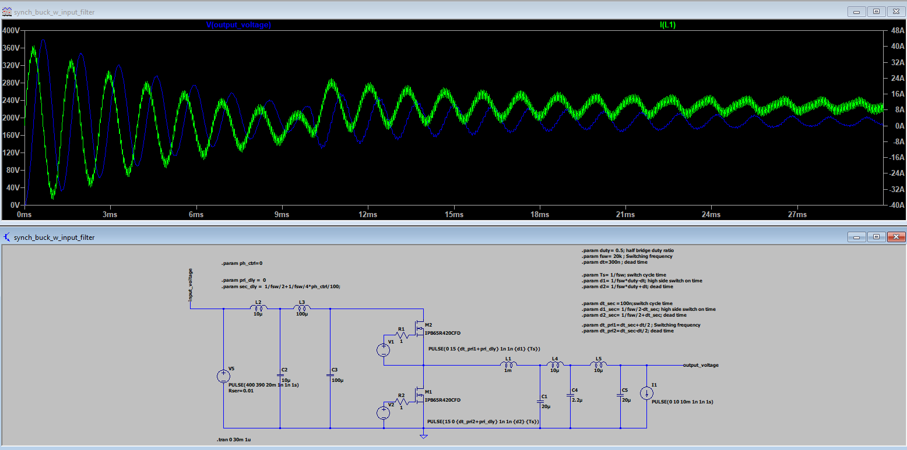
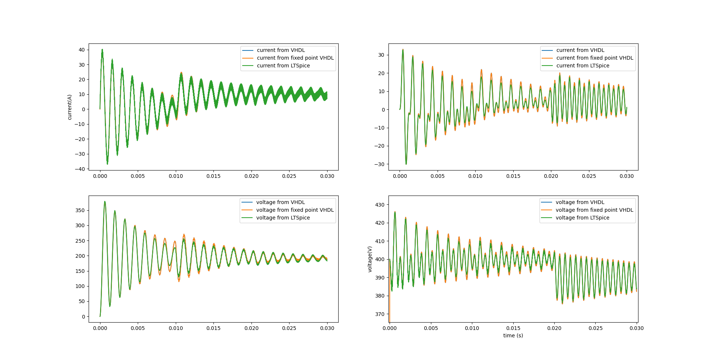
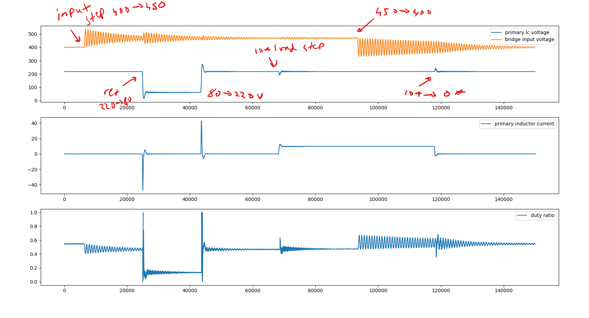

# VHDL_real_time_simulation
Simple project for for a blog post with synthesizable models of a filtered buck converter

The converter is as follows

  </a>

The converter is also simulated using fixed point VHDL and there is a simulation test run with which the responses between the lt spice and vhdl simulations can be compared

  </a>

The simulation model is built using Efinix Efinity to Efinix Titanium Evaluation kit. The FPGA simulation can be launched with the test_app.py python script. Doing this runs through input voltage, voltage referece and load current step responces and prints out the results in the following 

  </a>

